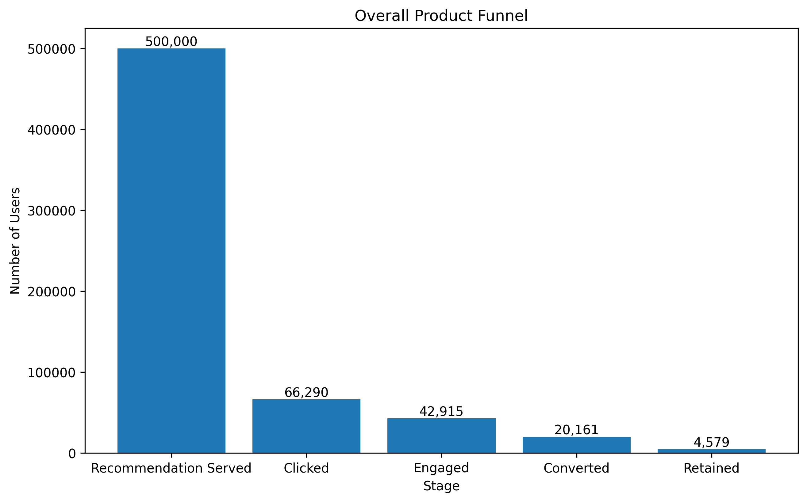
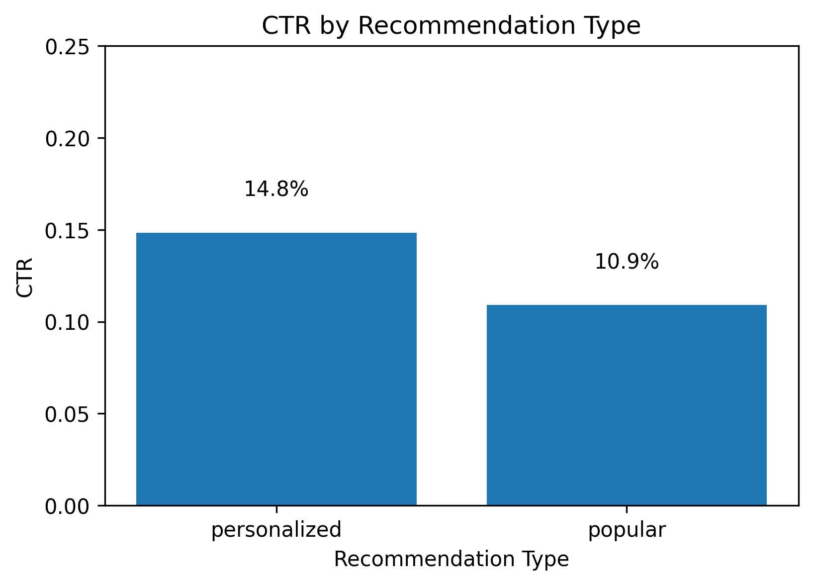
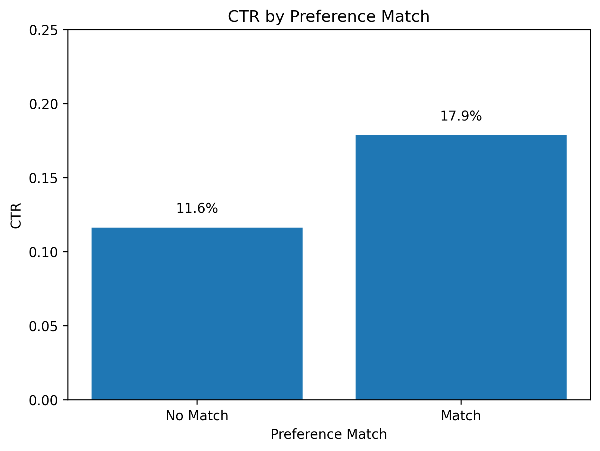
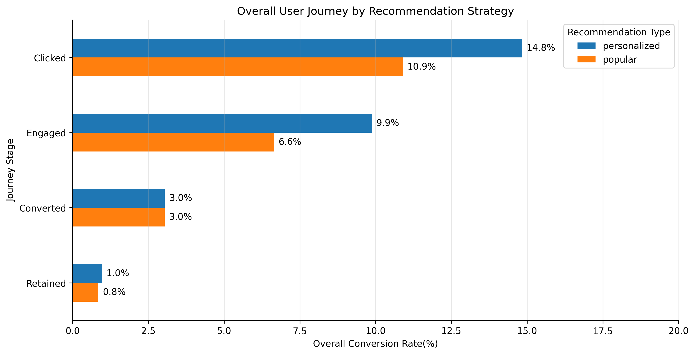
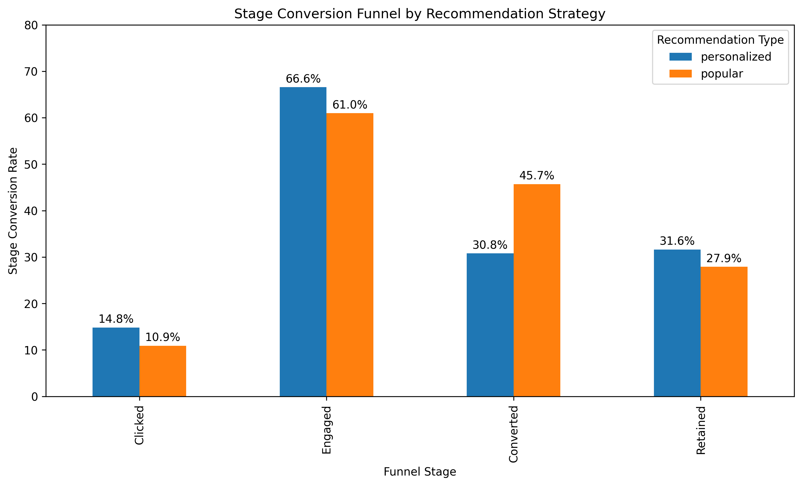

# Recommendation Strategy Impact on User Engagement and Retention：A Product Analytics Approach



## Project Overview

Recommendation systems play a critical role in modern digital platforms by helping users discover relevant content, products, or services. While Click-Through Rate (CTR) is widely used to evaluate recommendation quality, it captures only the first interaction and does not reflect downstream business outcomes.

This project simulates a large-scale recommendation platform and evaluates how **Personalized Recommendations** and **Popularity-based Recommendations** influence user behavior throughout the entire product journey. Instead of focusing solely on CTR, this project adopts a **Product Analytics** perspective by measuring user progression across multiple stages, including **Click, Engagement, Conversion, and Retention**.

---

# Business Problem

Many online platforms invest heavily in recommendation systems to increase user engagement and business growth. However, optimizing recommendations based only on CTR may overlook their long-term impact on user behavior.

This project investigates the following business questions:

- Do personalized recommendations consistently outperform popularity-based recommendations?
- Does higher CTR translate into stronger downstream engagement?
- How do recommendation strategies influence the complete product funnel?
- Which recommendation strategy creates greater long-term business value?

---

# Project Objectives

The objectives of this project are to:

- Simulate a realistic recommendation platform using synthetic behavioral data.
- Compare Personalized and Popularity-based recommendation strategies.
- Evaluate recommendation effectiveness using Product Analytics metrics.
- Perform statistical A/B testing.
- Analyze user behavior across the complete product funnel.
- Generate actionable business recommendations.

---

# Dataset Simulation

This project generates a synthetic recommendation ecosystem consisting of three interconnected datasets.

## Users

10,000 simulated users with:

- Age Group
- Geographic Region
- User Type (Casual / Active / Power)
- Content Preference

## Items

2,000 simulated items containing:

- Content Category
- Item Type (Standard / Premium / Trending)
- Popularity Score
- Quality Score

## Recommendation Logs

500,000 recommendation events recording:

- Recommendation Strategy
- User Information
- Item Information
- Preference Matching
- Click Probability
- User Behaviors

---

# Methodology

The project follows a complete Product Analytics workflow:

1. Generate synthetic users, items, and recommendation events.
2. Simulate user behavior using probabilistic models.
3. Evaluate recommendation performance using CTR.
4. Compare recommendation strategies across different user and content segments.
5. Conduct A/B Testing using a Two-Proportion Z-test.
6. Construct a multi-stage Product Funnel.
7. Generate business insights and product recommendations.

---

# Exploratory Data Analysis

## Recommendation Strategy Comparison

The first analysis compares the overall CTR of Personalized and Popularity-based recommendations.



**Key Insight**

Personalized recommendations consistently achieve higher click-through rates than popularity-based recommendations, suggesting that recommendation relevance is more effective than global popularity.

---

## Preference Matching Analysis

The impact of matching recommendations to user interests is evaluated below.



**Key Insight**

Matching recommended content to user preferences substantially improves user interaction, highlighting the importance of personalization.

---

## Additional CTR Analyses

Additional analyses were conducted to understand recommendation performance across multiple dimensions, including:

- User Type
- Content Category
- Item Type
- User Preference Match
- User Type × Recommendation Strategy
- Item Match

These analyses provide deeper insights into user behavior and recommendation effectiveness across different product segments.

---

# A/B Testing

A simulated A/B test was conducted to compare Personalized Recommendations against Popularity-based Recommendations.

The evaluation includes:

- Click-Through Rate (CTR)
- Absolute Lift
- Relative Lift
- Two-Proportion Z-test

Results demonstrate that Personalized Recommendations significantly outperform Popularity-based Recommendations with statistically significant improvements in user engagement.

---

# Product Funnel Analysis

## Overall User Journey

The following visualization compares the percentage of users reaching each stage of the overall product journey.



**Key Insight**

Although the initial CTR difference appears moderate, Personalized Recommendations consistently maintain higher performance throughout every downstream stage, resulting in stronger long-term user retention.

---

## Stage Conversion Funnel

The stage-by-stage conversion rates are shown below.



**Key Insight**

Personalized Recommendations outperform Popularity-based Recommendations at every transition stage, demonstrating that recommendation quality produces cumulative improvements across the product funnel.

---

# Business Insights

## 1. Personalized recommendations create long-term value.

Performance improvements extend beyond CTR and continue throughout Engagement, Conversion, and Retention.

---

## 2. Recommendation relevance compounds downstream business outcomes.

Small improvements in early user interactions accumulate into significantly stronger long-term business performance.

---

## 3. CTR alone is insufficient for evaluating recommendation systems.

Recommendation effectiveness should be measured using multiple product metrics, including:

- CTR
- Engagement
- Conversion
- Retention

---

## 4. Product teams should optimize for overall user value rather than clicks alone.

Optimizing recommendation relevance leads to stronger customer journeys and greater long-term platform performance.

---

# Technologies Used

- Python
- Pandas
- NumPy
- Matplotlib
- SciPy
- Statsmodels
- Jupyter Notebook

---

# Repository Structure

```
Recommendation Strategy Impact on User Engagement and Retention
│
├── data/
│
├── figures/
│   ├── overall_product_funnel.png
│   ├── ctr_by_recommendation_type.png
│   ├── ctr_by_preference_match.png
│   ├── overall_user_journey_by_recommendation_strategy.png
│   └── stage_conversion_funnel_by_recommendation_strategy.png
│
├── notebooks/
│   └── recommendation_strategy_analysis.ipynb
│
├── README.md
└── requirements.txt
```

---

# Future Improvements

Future enhancements may include:

- Collaborative Filtering
- Matrix Factorization
- Deep Learning-based Recommendation Models
- Real-world User Behavior Validation
- Cohort Analysis
- Long-term Retention Modeling

---

# Author

**Chunyu Liu**

M.S. in Biostatistics  
Rutgers University

**Areas of Interest**

- Data Science
- Product Analytics
- Recommendation Systems
- Machine Learning
- Business Intelligence